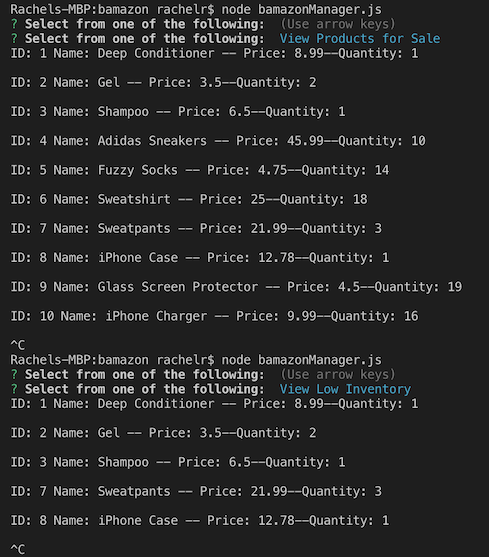

# bamazon

This application will run similar to that of amazon.com. Inside the mysql database are various products for sale. The application will display to the user all of the products available for sale. The user will then be asked if what product they would like to purchase. After entering the id number and quantity they would like to purchase, the database is automatically updated with the new stock quantity for each item 

Was able to get the application to run, however, I was having trouble being able to call the buyItem function to go through the process of purchasing another item.

I was able to get the general functionality of the manager page. The only problem I ran into was when trying to call the original prompt function after the execution of each callback. I starte to run into glitches after putting the initial prompt into a function and calling it in the other functions. The functionality of the applucation was fine before I tried to call the prompt as a function.

I attempted to start the supervisor part of the project, but I ran out of time trying to complete it. 

